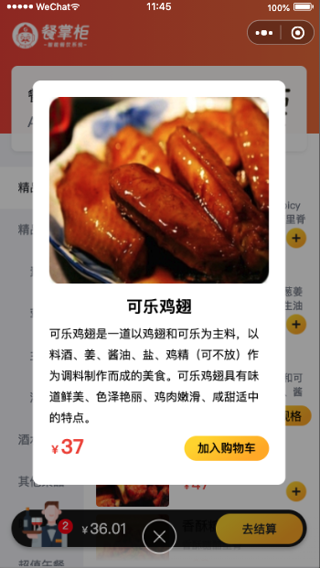

## 餐掌柜V2.0 - 小程序 

#### 技术： 

- uniapp + ws 

- http://ppsk.shop.eehp.cn/
- http://ppsk.shop.eehp.cn/doc.html#/model-shop-swagger/%E5%B0%8F%E7%A8%8B%E5%BA%8Fcontroller/showOrderVoforTableUsingPOST

- 账号pp@qq.com 密码：pass

#### 主要功能：

- 授权获取微信信息 -> 扫二维码进入小程序  ->  获取桌台信息 和当前桌台的状态 -> 用桌台ID和店铺id  获取菜品分类和菜单 -> 操作加减菜品 和菜品详情(加减菜为多人点餐，使用ws 推送购物车信息)   ->  下单付款å

- 页面效果

